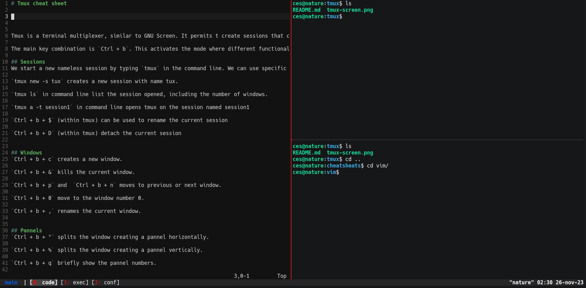

# Tmux cheat sheet

Cesar L. Pastrana, 2022


Tmux is a terminal multiplexer, similar to GNU Screen. It permits t create sessions that can be resumed even after ahving closed the execution. Multiplexing relies on multiple windows, which can indeed be splitted in several pannels at convenience.

The main key combination is `Ctrl + b`. This activates the mode where different functionalities are obtained by pressing an additional key.

## Sessions 
We start a new nameless session by typing `tmux` in the command line. We can use specific names to identify the session.

`tmux new -s tux` creates a new session with name tux.

`tmux ls` in command line list the session opened, including the number of windows.

`tmux a -t session1` in command line opens tmux on the session named session1

`Ctrl + b + $` (within tmux) can be used to rename the current session

`Ctrl + b + D` (within tmux) detach the current session


## Windows
`Ctrl + b + c` creates a new window.

`Ctrl + b + &` kills the current window.

`Ctrl + b + p` and  `Ctrl + b + n` moves to previous or next window.

`Ctrl + b + 0` move to the window number 0.

`Ctrl + b + ,` renames the current window.


## Pannels
`Ctrl + b + "` splits the window creating a pannel horizontally.

`Ctrl + b + %` splits the window creating a pannel vertically.

`Ctrl + b + q` briefly show the pannel numbers.

`Ctrl + b + arrows` to navigate among pannels.

`Ctrl + b + x` kill the pannel

## Other functionalities


## Configurations
Here is an example of my `tmux.conf`file:

```
set-option -g default-shell "/bin/bash"
set -g default-terminal "screen-256color"


## STATUS BAR PROPERTIES +++++++++++++++++++++++++++++++++++++++
set-option -g default-shell "/bin/bash"
set -g default-terminal "screen-256color"


## STATUS BAR PROPERTIES +++++++++++++++++++++++++++++++++++++++
set-option -g default-shell "/bin/bash"
set -g default-terminal "screen-256color"


## STATUS BAR PROPERTIES +++++++++++++++++++++++++++++++++++++++
# Statusbar
set -g status-fg white
set -g status-bg colour236

# Session name on the left side
set -g status-left "  #[fg=colour27]#S#[fg=white]  |  "
set -g status-style "bright"

## PANELS COLOURS
# Default window title colors
# (#F is the active symbol, #W in the window name; #I is the window index)
setw -g window-status-style fg=white # grey
setw -g window-status-style bg=color236
setw -g window-status-style "none"
setw -g window-status-format "[#[fg=colour1]#I: #[fg=white]#W]"

# Active window
setw -g window-status-current-style fg=white
#setw -g window-status-current-style bg=colour240
setw -g window-status-current-style  "bright"
#In Tmux3.3 you need to set the colour of the background here (the setw... bg=xxx  above is ignored)
setw -g window-status-current-format "#[bg=colour240][#[fg=colour196]#I: #[fg=white]#W]"

# Window activity
setw -g window-status-activity-style fg=colour246 # grey
setw -g window-status-activity-style bg=black

#set-window-option -g window-status-style bg=colour124,fg=colour0 # bg=yellow, fg=bg1

#-----------------------------------------------------------------


# PANES ++++++++++++++++++++++++++++++++++++++++++++++++++++++++++

# Active pane border color
set-option -g pane-active-border-style fg=colour1

# Inactive pane border color
set-option -g pane-border-style fg=colour236

#-----------------------------------------------------------------

set-window-option -g window-status-bell-style bg=colour167,fg=colour235 # bg=red, fg=bg

```
The result is:
<p align="center">
    
</p>
Note that there are subtle variations in the configuration commands depending on the tmux version (3.3 for the configuration file above).
