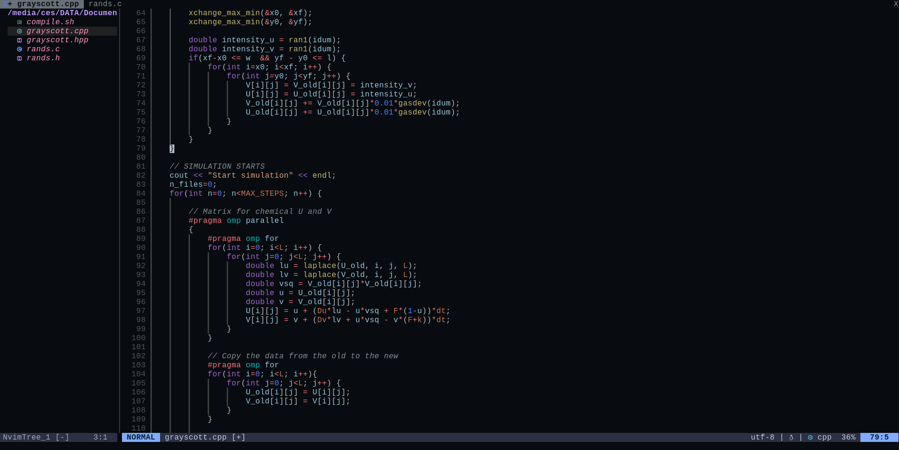

# VIM cheat sheet

Cesar L. Pastrana, 2022

This is a cheat sheet of commands to be used with VIM, focused on its configuration and usage as a ligthweigth IDE.

## Text manipulation
### Copy, Cut and Paste
First, we need to go to Visual mode `Ctrl + V`. Then, we are allowed to select text. If we have the command `set mouse=a` we can use the text for it. Once the desired text has been selected,

`Ctrl + y` to copy (yank) the text

`Ctrl + d` to cut (delete) the text

`Ctrl + p/P` to paste the text after or before the cursor

### Undo/Redo
`Esc + u` in normal mode to undo (alas Ctrl+Z)

`Ctrl + R` to redo

Since vim 7.3 there is persistent undo, such that changes are stored in a file. This permits to undo even after having closed the file.

### Indentation
In Insert mode:

`Ctrl + t` to indent the current line

`Ctrl + d` to remove one indentation in the current line

In Visual mode we can indent blocks of text. Go to visual mode `Ctrl + V`, select the text to indent and use
`>` to add indent

`<` to remove indent.

`=` In visual mode, it indents everything automatically following vim's wiseness 

`gg=G` indents everything automatically following vim's wiseness 

### Text autocompletion 
`Ctrl + p` or `Ctrl + n` autompletes considering previous and next the position of the cursor.

## Tabs
We can skip this process by using `tmux`. If we still want to use tab inside vim:
`:tabnew` to create a tab

`:tabnew file.py` to open `file.py` in a new tab

`:tablose` closes the current tab

`:tablose file.py` closes the tab corresponding to `file.py`

`:tabn N` to move to tab number $N$

`gt` to move to the next tab

`gT` to move to the previou tab

## Combination with bash
Using the exclamation mark `:! command` (as in Gnuplot) we can run commands without having to go out of vim. This is very practical to compile quickly or to do git commits.

## Configuration

### Basic configuration
My `~/.vimrc` file is simple and can be downlaoded from this Repo.

The jellybeans colorscheme is not installed by default and needs to be downloaded externally (monokai is other colorscheme among my favourites). Colorscheme files are placed on the folder `~/.vim/colors/`. We can see the installed colorscheme by `: colorscheme ` followed by `Ctrl+d`

### Useful plug-ins 
There are some interesting functionalities that makes your life easier when VIM is used to write code. We need, however, to install external plugins (more to be discussed on Neovim).

## NEOVIM
Neovim is Vim on steroids. By appropiately configurating it, we can have a customised IDE with plenty of functionalities.
In particular, I started from the `init.lua` file that can be downloaded in the external [GitHub repo](https://github.com/nvim-lua/kickstart.nvim). The details of the plugins are described here: [https://www.youtube.com/watch?v=stqUbv-5u2s](https://www.youtube.com/watch?v=stqUbv-5u2s).
This configuration file is very convenient: better highlighting of variables (nvim-treesitter), LSP text prediction (mason), and optimised search (Telescope). The managment of the plugins rely on  the lazy.vim manager.
For the inclusion of LSP predictions, type `Mason`, search for the language of interest and type `i`,

I modified the Lua file and included personal plugins and configurations:
- Modified colours theme to `midnight` and lua-line to 'cattppuci'.
- Exploration pannel toggled with `Ctrl+N` with nicely looking icons using nerd-icons (need to download the [Nerd fonts](https://www.nerdfonts.com/), otherwise the icons look odd).
- Shortcut to create new tabs with `Ctrl+t`.
- Spell checker, allowing to use nvim for LaTeX documents. It is by default not enabled but it can be enabled via `:set invspell`.

This is how it looks:

    

This personal `init.lua` file is located in this repository. To make it work simply paste it in the folder `~/.config/nvim/`.

